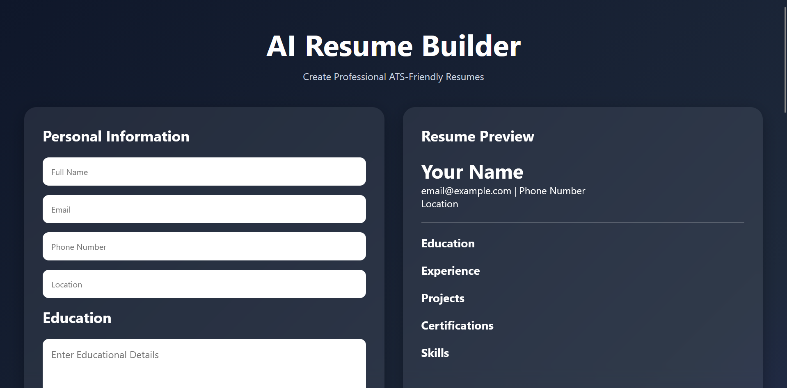
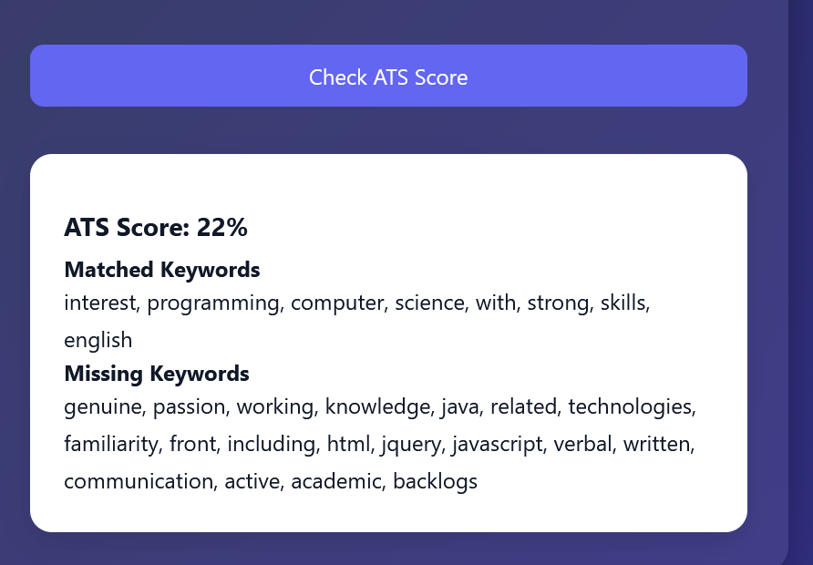

# AI Resume Builder & ATS Score Checker

## Overview

AI Resume Builder & ATS Score Checker is a React-based web application that helps users create professional, ATS-friendly resumes using Google's Gemini API. The application generates resumes from user-provided information and evaluates them using an ATS scoring system that provides feedback and improvement suggestions.

---

## Features

- AI-powered resume generation using Gemini API
- ATS score analysis and recommendations
- Resume preview before download
- PDF export functionality
- Dynamic sections for:
  - Personal Information
  - Education
  - Work Experience
  - Projects
  - Certifications
  - Skills
- Responsive user interface
- Real-time AI assistance

---

## System Architecture

```text
User
  │
  ▼
React Frontend
  │
  ▼
Gemini API
  │
  ▼
ATS Analyzer
  │
  ▼
Resume Preview & PDF Export
```

---

## Technology Stack

| Component | Technology |
|------------|------------|
| Frontend | React.js |
| Styling | CSS3 |
| AI Integration | Gemini API |
| PDF Generation | jsPDF |
| Version Control | Git & GitHub |
| Deployment | Vercel |

---

## Installation

### Clone the Repository

```bash
git clone https://github.com/123098-ux/ai-resume-builder.git
```

### Navigate to Project Directory

```bash
cd my-app
```

### Install Dependencies

```bash
npm install
```

### Start Development Server

```bash
npm start
```

The application will run at:

```text
http://localhost:3000
```

---

## Environment Variables

Create a `.env` file in the project root:

```env
REACT_APP_GEMINI_API_KEY=YOUR_GEMINI_API_KEY
```

---

## Project Structure

```text
src/
├── components/
├── services/
├── utils/
├── assets/
├── App.js
└── index.js

public/

README.md
package.json
```

---

## ATS Scoring Criteria

The ATS score is calculated based on:

- Skills Coverage
- Keyword Presence
- Section Completeness
- Resume Formatting
- Resume Length

The application also provides suggestions to improve the overall ATS score.

---

## Screenshots

### Home Page




### ATS Analysis



---

## Future Enhancements

- Job description matching
- Cover letter generation
- Multiple resume templates
- LinkedIn profile integration
- Multi-language support
- Advanced ATS analytics

---

## Deployment

Live Demo:  https://ai-resume-builder-fawn-three.vercel.app/

---

## Author

**Deleeshya Davis**

---

## License

This project is developed for educational and learning purposes.
